# Chhōe Tâigí Shortcuts

[Chhōe Tâigí](https://chhoe.taigi.info/) sī chiok hó ēng ê Tâigí sûtián bāngchām

m̄koh khòaⁿ tio̍h bōehiáu ê jī tio̍h ài phahkhui bāngchām

chi̍t jī chi̍t jī chhâ si̍tchāi siuⁿ hùikhì

<!--more-->

téng pái siāukài ê [Chhōe Tâigí Chrome Extension](../chhoe-taigi-chrome-extensions)

kanna káikoat tiāu ēng tiānnáu chhōe jī ê khùnkéng

ēng kiá chhōe iûgoân sī chiok hùikhì

só͘í tio̍h ū chi̍t ê kesi ê chhuthiān

[Chhōe Tâigí Shortcuts](https://www.icloud.com/shortcuts/40e5ab95dabe4531827dbb4690eeec83)

seng demo hō͘ lín khòaⁿ



nāsī ū ēng kòe iOS 12 ê sin konglêng **[Shortcuts](https://support.apple.com/guide/shortcuts/welcome/ios)** ê lâng engkai sī bōe ū siáⁿ būntê

khólū tio̍h m̄bat ēng kòe ê lâng khólêng kah chōe

sòa--lo̍hlâi tio̍h lâi nā khòaⁿ tô͘  nā o̍h

lân ū saⁿchióng hongsek ēsái ēng

## 1. Ēng widget chhōe

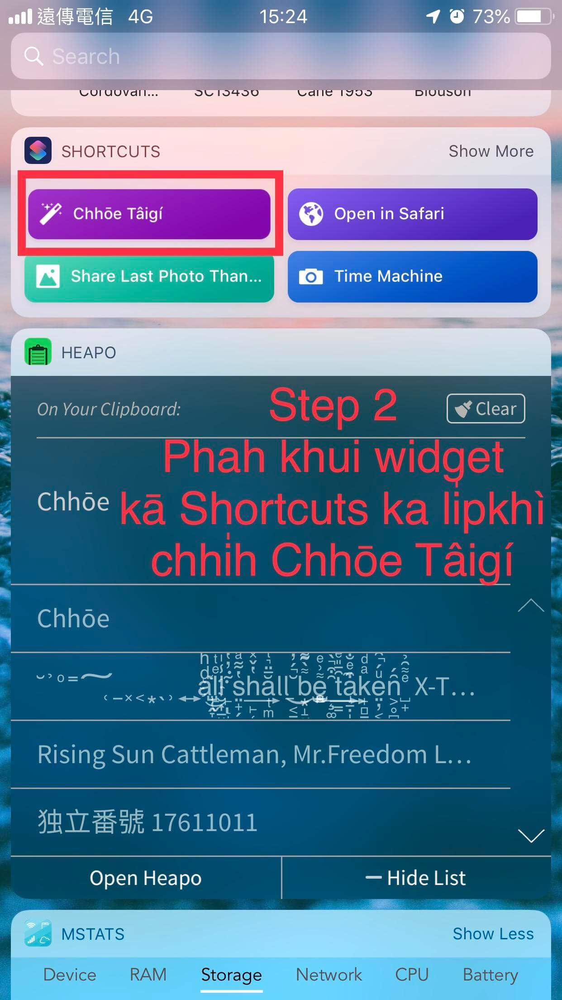
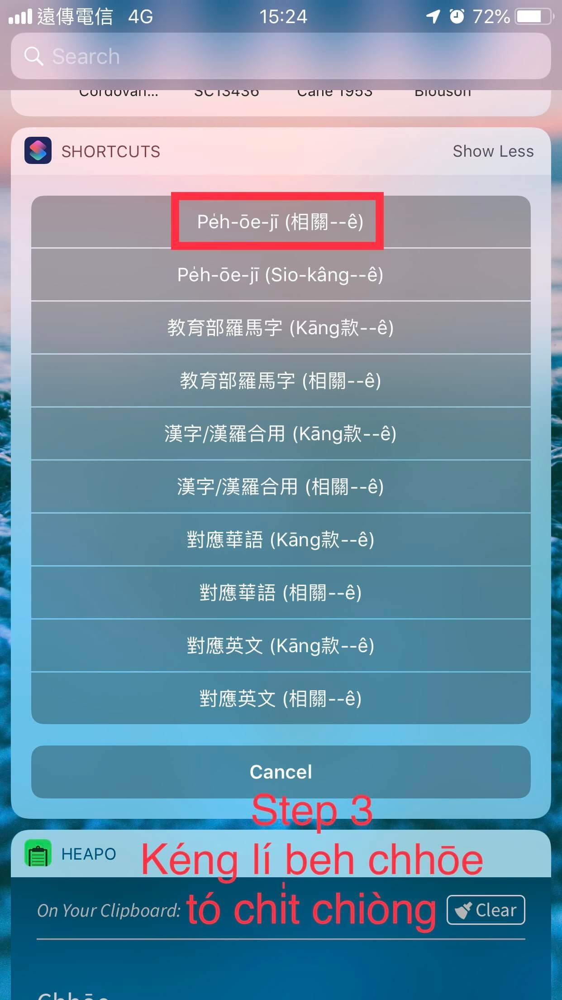
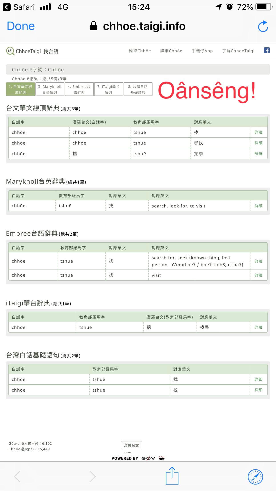

## 2. Ēng siri chhōe

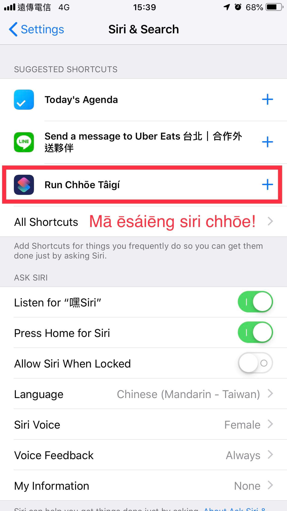
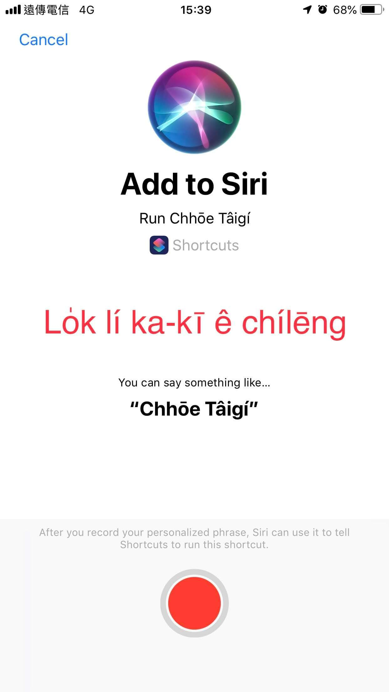
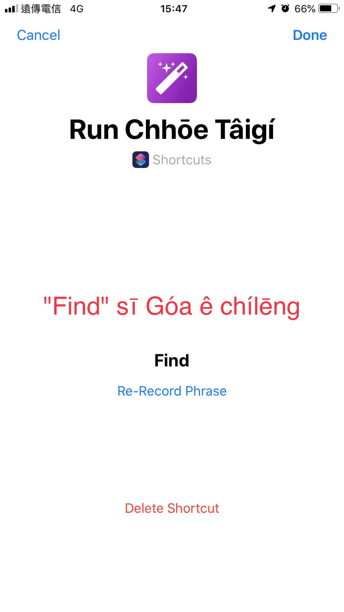
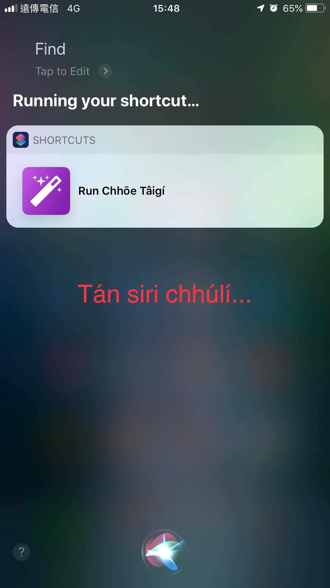
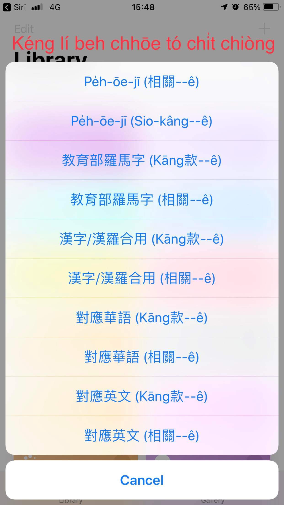
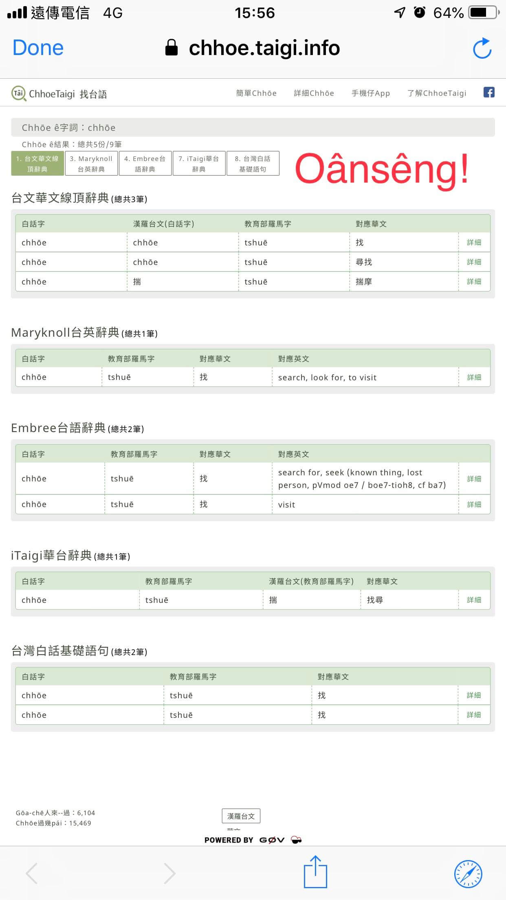

## 3. Ūi chúōebīn chhōe

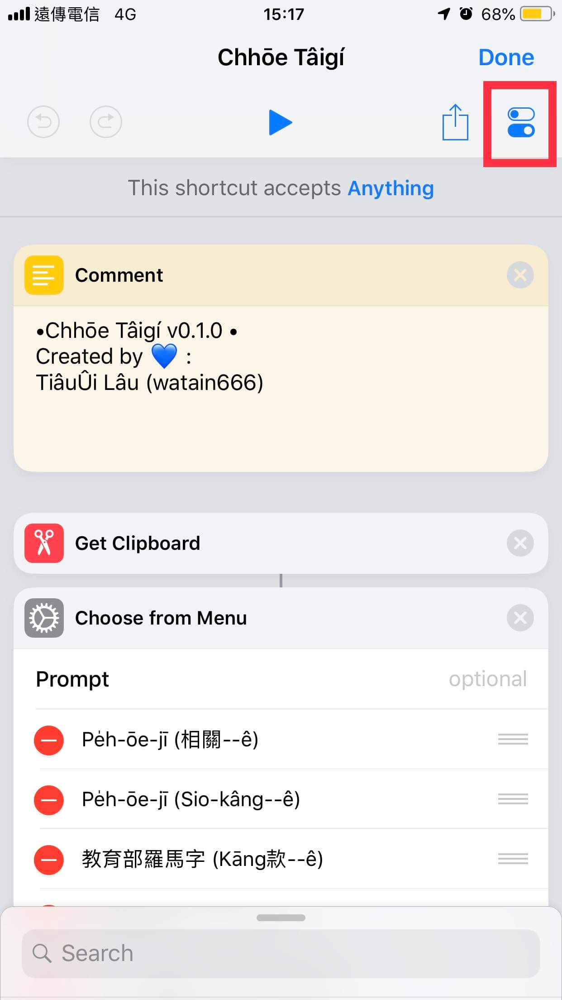
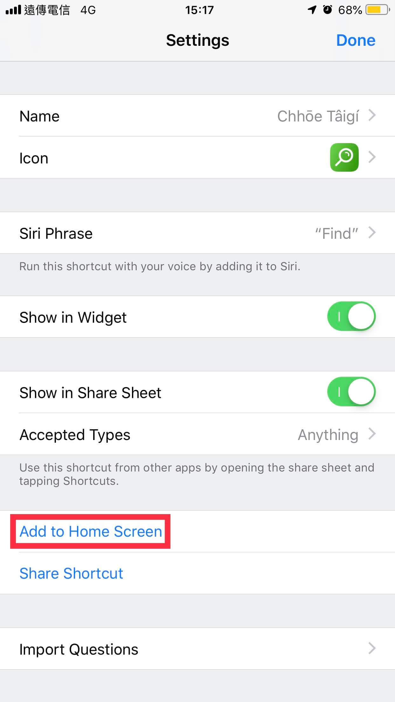
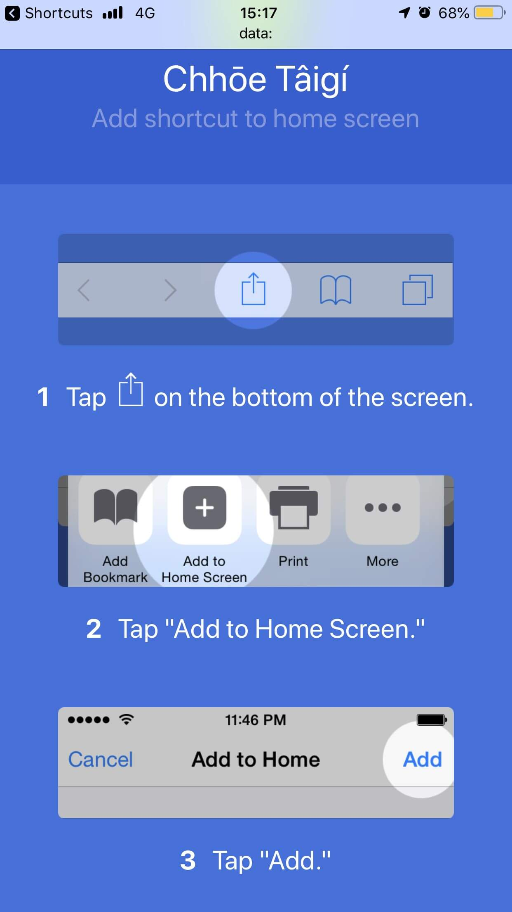
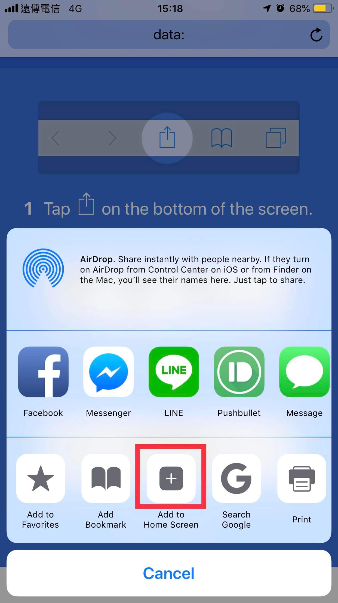
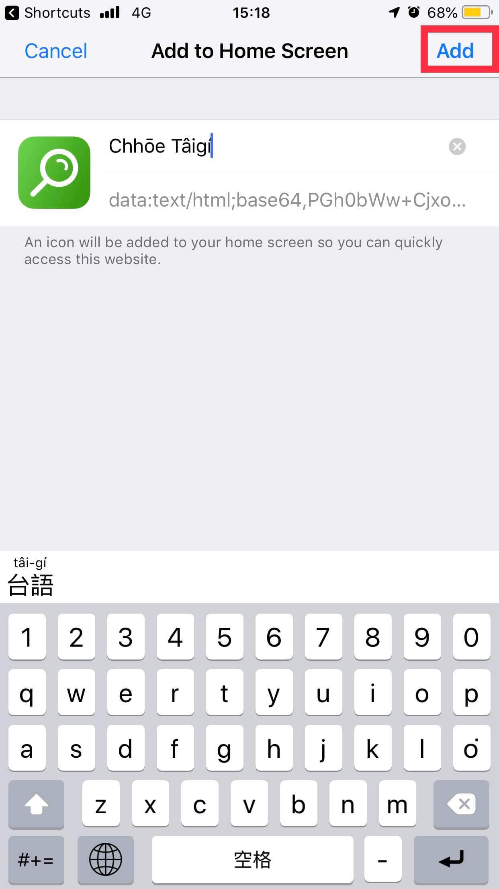
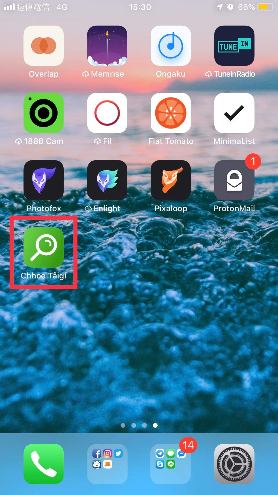

[Download Chhōe Tâigí Shortcuts](https://www.icloud.com/shortcuts/40e5ab95dabe4531827dbb4690eeec83)

