# Chhōe Tâigí 捷徑

[Chhōe Tâigí](https://chhoe.taigi.info/) 是一個非常好用的台語辭典網站

不過在網路上看到不會的字就要打開網站，一個字一個字的去查，實在是很麻煩

<!--more-->

上次介紹的 [Chhōe Tâigí ê Chrome Extension](../chhoe-taigi-chrome-extensions)

只解決了用電腦查字典的情境

用手機查字典還是一樣麻煩

所以才會有這個工具出現

[Chhōe Tâigí 捷徑](https://www.icloud.com/shortcuts/40e5ab95dabe4531827dbb4690eeec83)

先來 demo 使用流程



如果有用過 iOS 12 的新功能 **[捷徑](https://support.apple.com/guide/shortcuts/welcome/ios)** 的人應該是不會有什麼問題

但考慮到沒用過的人可能比較多

接下來就來看圖學要怎麼使用吧

我們有 3 種查的方法

## 1. 用小工具找

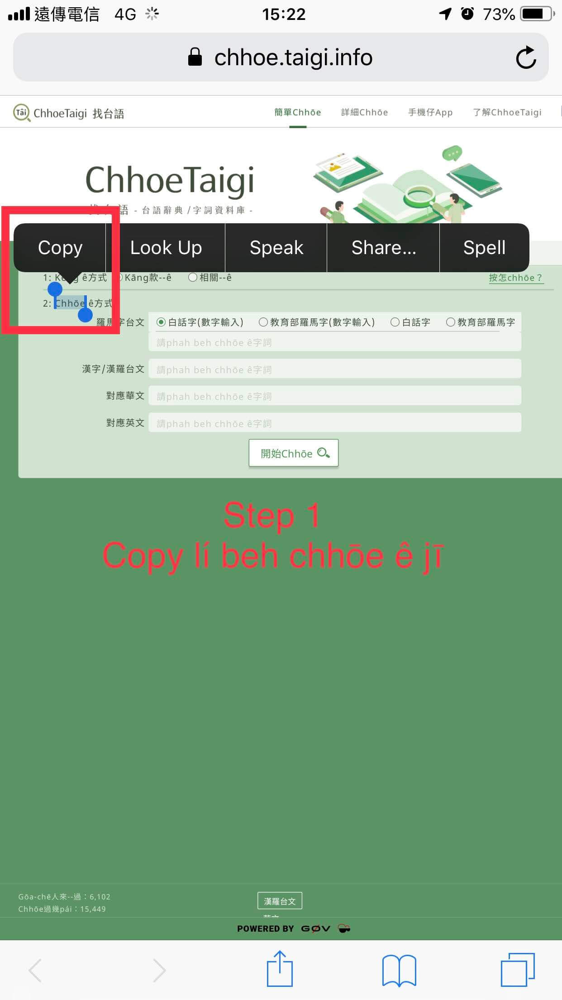
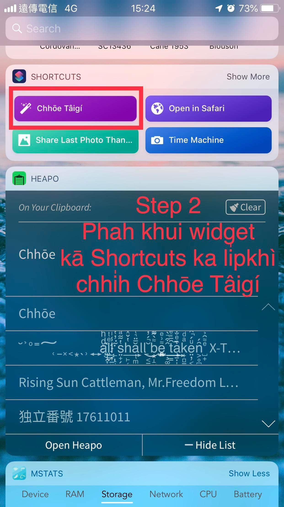
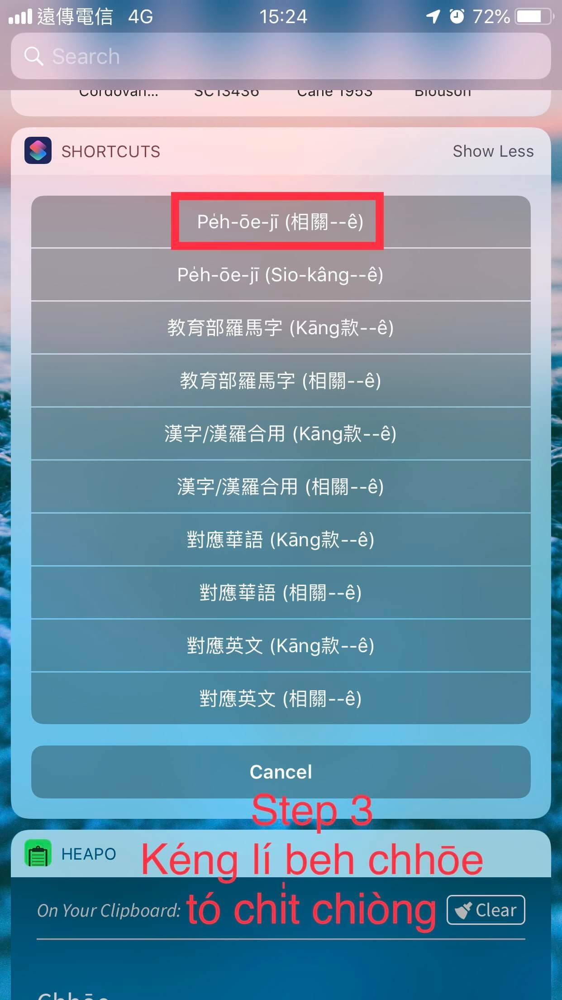
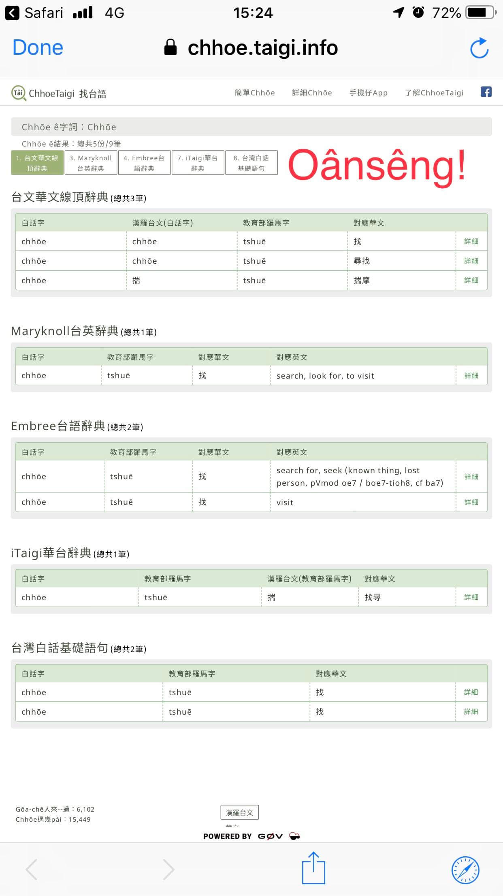

## 2. 用 siri 找

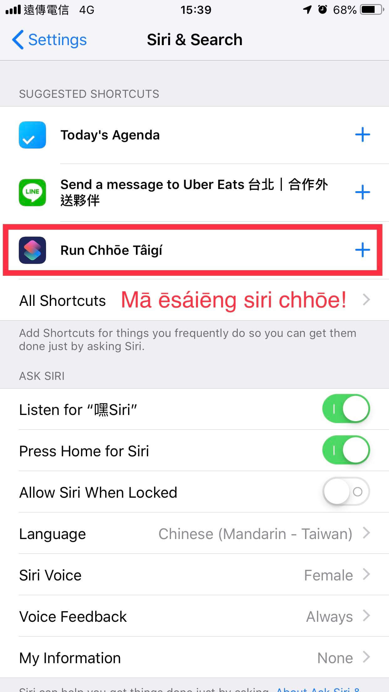
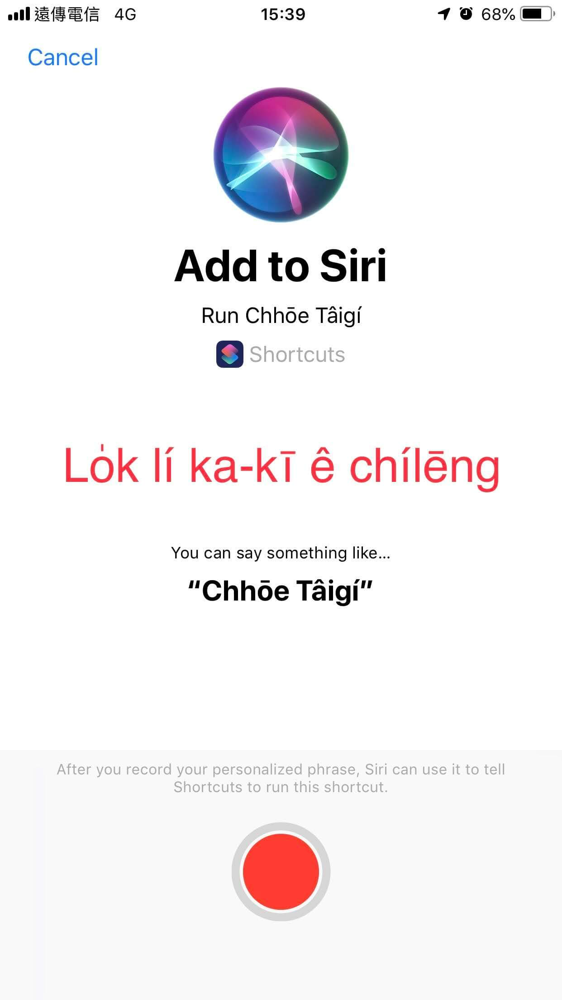
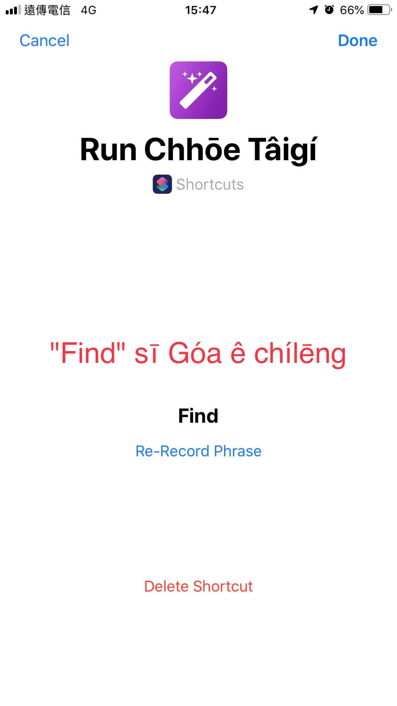
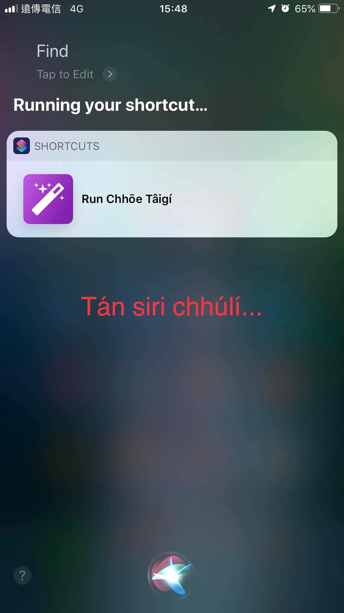
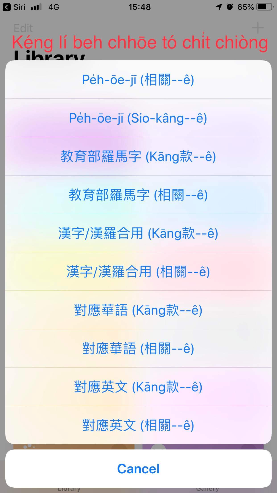
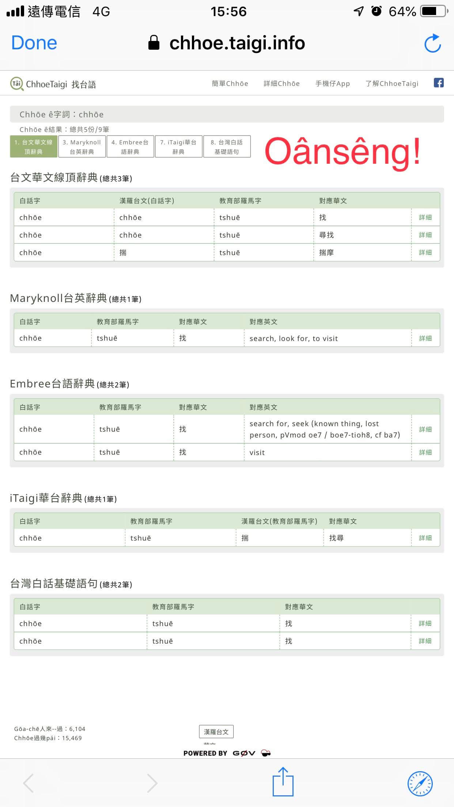

## 3. 從桌面找

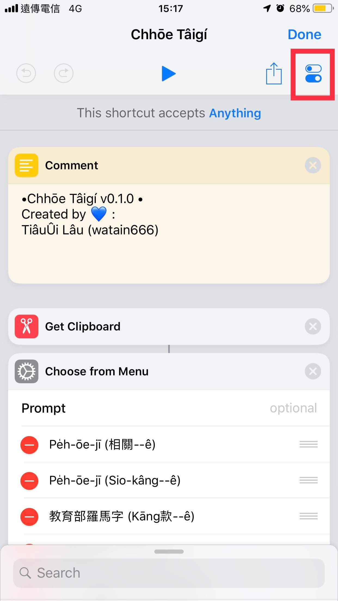
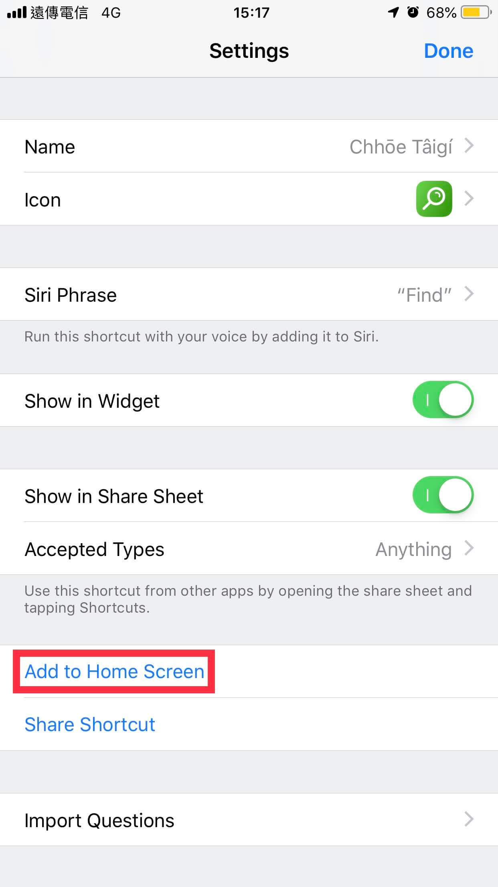
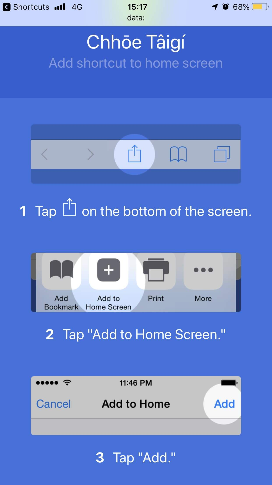

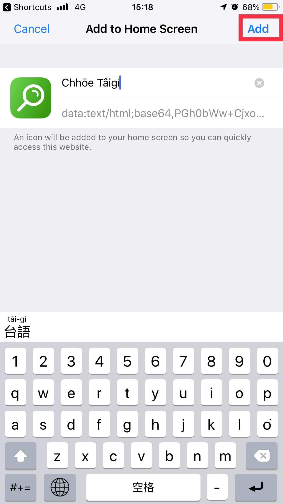
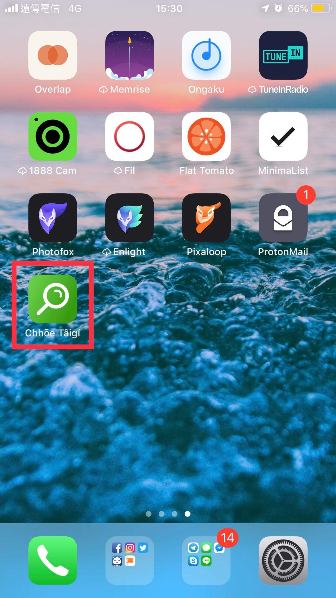

[下載 Chhōe Tâigí 捷徑](https://www.icloud.com/shortcuts/40e5ab95dabe4531827dbb4690eeec83)

