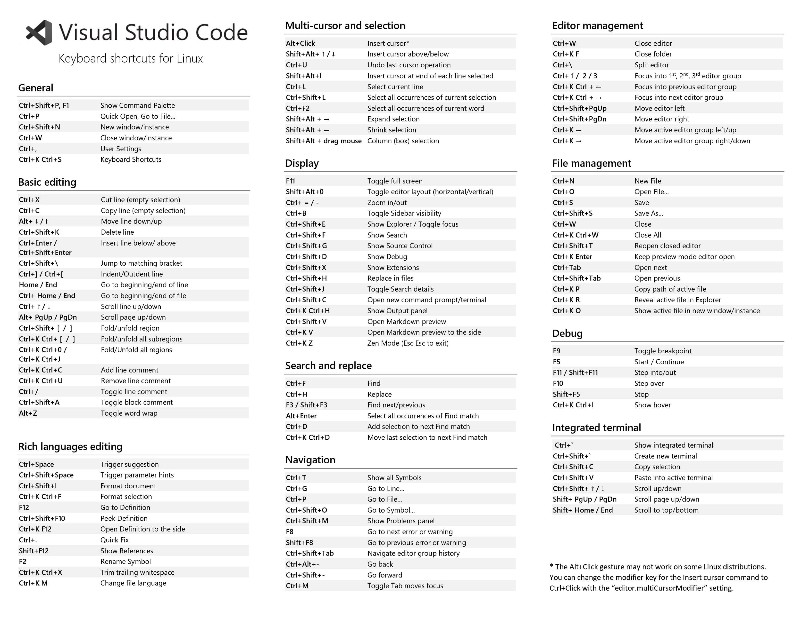
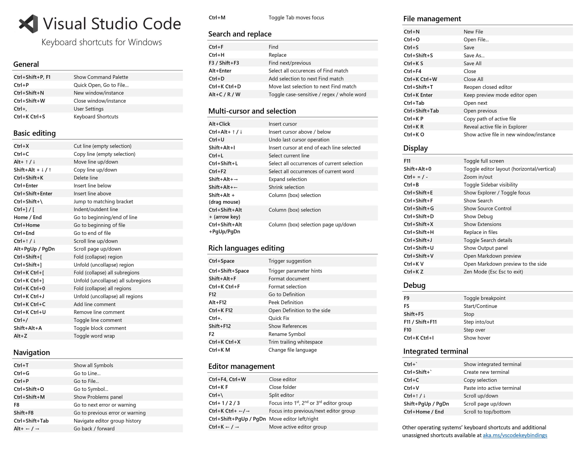
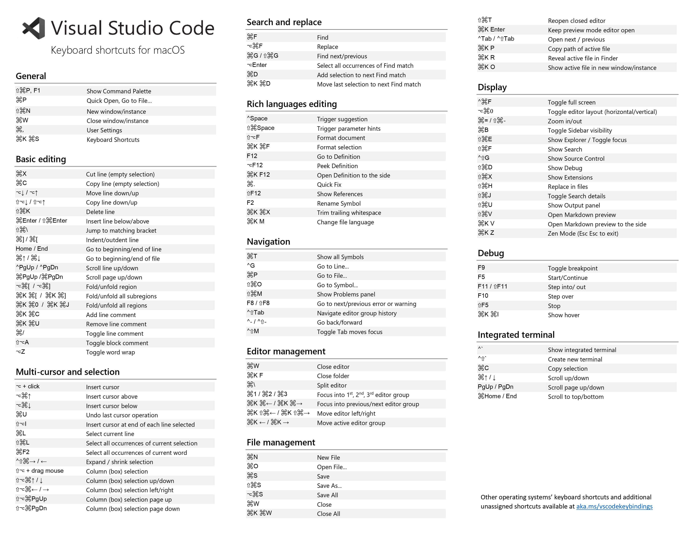

# Editor introduction VS Code & Note

由於公司電腦效能不夠，Php Storm 的速度實在是太慢了
所以我就拋棄 [Php Storm](https://www.jetbrains.com/phpstorm/) 奔向 [VS Code](https://code.visualstudio.com/) 的懷抱了。

微軟這次真的是佛心來著，以往死愛錢微軟這次開發了一款免錢又非常好用的跨平台編輯器，不管你是用 Linux 還是用 macOS 的非 Windows 使用者都可以無痛使用!!

而且 VS Code 是開源專案，更新/維護之頻繁有興趣可以直接到他們的 [Github頁面](https://github.com/Microsoft/vscode) 上看看 Commit 紀錄。(望向遠方 Beta 4 年還一直跳出視窗要你 donate 的 Sublime Text 3)

他們還有提供給早期使用者的版本叫 [VS Code Insiders](https://code.visualstudio.com/insiders)，VS Code Insiders 有著最新的 releases 版本而且每天更新，而且它和 VS Code 是各自獨立安裝 (但這也意味著插件和設定不會同步，這部份需要用 Sync 插件來解，有空再寫)，你不需要擔心切換麻煩的問題，一下想用 VS Code，一下想用 VS Code Insiders，也只需要點一下滑鼠關閉 VS Code 再點一下滑鼠開啟 VS Code Insiders 就可以了 (我試過同時執行很容易 Crash)

這款 VS Code 號稱介於 Editor 和 IDE 之間的輕量型編輯器，內建 Git 版本控制和 Debug 模式，而且現在已經有相當豐富的社群和資源，雖然我覺得內建的 Git Gui 沒有到很好用，只能算堪用，如果不想下 CLI 或懶得開其他 Git GUI，就能在編輯器裡一氣呵成。
這邊有篇簡單的介紹 [[Git]使用VS Code的Git功能](https://dotblogs.com.tw/lapland/2016/04/19/172848)
(順便幫同樣也是跨平台漂亮又好用的 [GitKraken](https://www.gitkraken.com/) 工商一下)

雖然不曉得老大哥背後在打什麼如意算盤，反正這次我是服了，
總之這篇文章我會整裡一些筆記和心得，持續更新。

---

## 鍵盤快捷鍵
這份快捷鍵是 Windows 版的，不過 Linux 和 Windows 的大同小異。

### 常用 General

| 按 Press             | 功能 Function                       |
| :------------------- | :---------------------------------- |
| Ctrl + Shift + P、F1 | 顯示命令面板 Show Command Palette   |
| Ctrl + P             | 快速開啟 Quick Open                 |
| Ctrl + Shift + N     | 新視窗/實例 New window/instance     |
| Ctrl + Shift + W     | 關閉視窗/實例 Close window/instance |

### 基礎編輯 Basic editing

| 按 Press              | 功能 Function                                               |
| :-------------------- | :---------------------------------------------------------- |
| Ctrl + X              | 剪下行（空選取）Cut line (empty selection)                  |
| Ctrl + C              | 複製行（空選取）Copy line (empty selection)                 |
| Alt + ↑ / ↓         | 向上/下移動行 Move line up/down                             |
| Shift + Alt + ↓ / ↑ | 向上/下複製行 Copy line up/down                             |
| Ctrl + Shift + K      | 刪除行 Delete line                                          |
| Ctrl + Enter          | 往下插入一行 Insert line below                              |
| Ctrl + Shift + Enter  | 往上插入一行 Insert line above                              |
| Ctrl + Shift + \      | 跳到匹配的括號 Jump to matching bracket                     |
| Ctrl + ] / [          | 縮排/凸排 Indent/outdent line                               |
| Home                  | 跳到行首 Go to beginning of line                            |
| End                   | 跳到行尾 Go to end of line                                  |
| Ctrl + Home           | 跳到檔頭 Go to beginning of file                            |
| Ctrl + End            | 跳到檔尾 Go to end of file                                  |
| Ctrl + ↑ / ↓        | 向上/下捲動行 Scroll line up/down                           |
| Alt + PgUp / PgDown   | 向上/下捲動頁面 Scroll page up/down                         |
| Ctrl + Shift + [      | 折疊（折疊）區域 Fold (collapse) region                     |
| Ctrl + Shift + ]      | 展開（未折疊）區域 Unfold (uncollapse) region               |
| Ctrl + K Ctrl + [     | 折疊（未折疊）所有子區域 Fold (collapse) all subregions     |
| Ctrl + K Ctrl + ]     | 展開（未折疊）所有子區域 Unfold (uncollapse) all subregions |
| Ctrl + K Ctrl + 0     | 折疊（折疊）所有區域 Fold (collapse) all regions            |
| Ctrl + K Ctrl + J     | 展開（未折疊）所有區域 Unfold (uncollapse) all regions      |
| Ctrl + K Ctrl + C     | 增加行註解 Add line comment                                 |
| Ctrl + K Ctrl + U     | 刪除行註解 Remove line comment                              |
| Ctrl + /              | 切換行註解 Toggle line comment                              |
| Shift + Alt + A       | 切換區塊註解 Toggle block comment                           |
| Alt + Z               | 切換自動換行 Toggle word wrap                               |

### 導航 Navigation

| 按 Press           | 功能 Function                                        |
| :----------------- | :--------------------------------------------------- |
| Ctrl + T           | 顯示所有符號 Show all Symbols                        |
| Ctrl + G           | 跳到行... Go to Line...                              |
| Ctrl + P           | 跳到檔案... Go to File...                            |
| Ctrl + Shift + O   | 跳到符號... Go to Symbol...                          |
| Ctrl + Shift + M   | 顯示問題面板 Show Problems panel                     |
| F8                 | 跳到下一個錯誤或警告 Go to next error or warning     |
| Shift + F8         | 跳到上一個錯誤或警告 Go to previous error or warning |
| Ctrl + Shift + Tab | 導航編輯器組歷史記錄 Navigate editor group history   |
| Alt + ← / →      | 返回/前進 Go back / forward                          |
| Ctrl + M           | 切換選項卡移動焦點 Toggle Tab moves focus            |

### 搜尋和取代 Search and replace

| 按 Press          | 功能 Function                                                                |
| :---------------- | :--------------------------------------------------------------------------- |
| Ctrl + F          | 尋找 Find                                                                    |
| Ctrl + H          | 取代 Replace                                                                 |
| F3 / Shift + F3   | 尋找下/上一個 Find next/previous                                             |
| Alt + F3          | 選取所有項目 Select all occurences of Find match                             |
| Ctrl + D          | 選擇下一個匹配 Add selection to next Find match                              |
| Ctrl + K Ctrl + D | 將最後一個選擇選項下一個找到的相符項 Move last selection to next Find match  |
| Alt + C / R / W   | 切換區分大小寫/正規表達式/整個詞  Toggle case-sensitive / regex / whole word |

### 多游標和選擇 Multi-cursor and selection

| 按 Press                           | 功能 Function                                                           |
| :--------------------------------- | :---------------------------------------------------------------------- |
| Alt + 單擊                         | 插入游標 Insert cursor                                                  |
| Ctrl + Alt + ↑ / ↓               | 在上/下插入游標 Insert cursor above / below                             |
| Ctrl + U                           | 還原上一個游標操作 Undo last cursor operation                           |
| Shift + Alt + I                    | 在選取的每一行的末尾插入游標 Insert cursor at end of each line selected |
| Ctrl + I                           | 選擇當前行 Select current line                                          |
| Ctrl + Shift + L                   | 選擇當前選擇的所有出現 Select all occurrences of current selection      |
| Ctrl + F2                          | 選擇當前字的所有出現 Select all occurrences of current word             |
| Shift + Alt + →                   | 展開選擇 Expand selection                                               |
| Shift + Alt + ←                   | 縮小選擇 Shrink selection                                               |
| Shift + Alt +（拖曳游標）          | 列（框）選擇 Column (box) selection                                     |
| Ctrl + Shift + Alt +（箭頭鍵）     | 列（框）選擇 Column (box) selection                                     |
| Ctrl + Shift + Alt + PgUp / PgDown | 列（框）選擇上/下頁 Column (box) selection page up/down                 |

### 豐富的語言編輯 Rich languages editing

| 按 Press             | 功能 Function                                          |
| :------------------- | :----------------------------------------------------- |
| Ctrl + 空格          | 觸發建議 Trigger suggestion                            |
| Ctrl + Shift + Space | 觸發器參數提示 Trigger parameter hints                 |
| Tab                  | Emmet 展開縮寫 Emmet expand abbreviation               |
| Shift + Alt + F      | 格式化檔案 Format document                             |
| Ctrl + K Ctrl + F    | 格式選取區域 Format selection                          |
| F12                  | 跳到定義 Go to Definition                              |
| Alt + F12            | 預覽定義 Peek Definition                               |
| Ctrl + K F12         | 從旁邊打開定義 Open Definition to the side             |
| Ctrl + .             | 快速解決 Quick Fix                                     |
| Shift + F12          | 顯示引用 Show References                               |
| F2                   | 重新命名符號 Rename Symbol                             |
| Ctrl + Shift + . / , | 替換為下一個/上一個值 Replace with next/previous value |
| Ctrl + K Ctrl + X    | 修剪尾隨空格 Trim trailing whitespace                  |
| Ctrl + K M           | 更改檔案語言 Change file language                      |

### 編輯器管理 Editor management

| 按 Press                     | 功能 Function                                                       |
| :--------------------------- | :------------------------------------------------------------------ |
| Ctrl + F4、Ctrl + W          | 關閉編輯器 Close editor                                             |
| Ctrl + K F                   | 關閉檔案夾 Close folde                                              |
| Ctrl + \                     | 分割編輯器 Split editor                                             |
| Ctrl + 1 / 2 / 3             | 聚焦到第1，第2或第3編輯器組 Focus into 1st, 2nd or 3rd editor group |
| Ctrl + K Ctrl + ← / →      | 聚焦到上/下一個編輯器組 Focus into previous/next editor group       |
| Ctrl + Shift + PgUp / PgDown | 向左/向右移動編輯器 Move editor left/right                          |
| Ctrl + K ← / →             | 移動活動編輯器組 Move active editor group                           |

### 檔案管理 File management

| 按 Press           | 功能 Function                                                       |
| :----------------- | :-------------------------------------------------------------------|
| Ctrl + N           | 新檔案 New File                                                     |
| Ctrl + O           | 打開檔案... Open File...                                            |
| Ctrl + S           | 保存 Save                                                           |
| Ctrl + Shift  + S  | 另存為... Save As...                                                |
| Ctrl + K S         | 全部保存 Save All                                                   |
| Ctrl + F4          | 關閉 Close                                                          |
| Ctrl + K Ctrl + W  | 關閉所有 Close All                                                  |
| Ctrl + Shift + T   | 重新打開關閉的編輯器 Reopen closed editor                           |
| Ctrl + K           | 輸入保持打開 Enter Keep Open                                        |
| Ctrl + Tab         | 打開下一個 Open next                                                |
| Ctrl + Shift + Tab | 打開上一個 Open previous                                            |
| Ctrl + K P         | 複製當前檔案的路徑 Copy path of active file                         |
| Ctrl + K R         | 顯示資源管理器中的當前檔案 ReveAlt active file in Explorer          |
| Ctrl + K O         | 顯示新視窗/實例中的當前檔案 Show active file in new window/instance |

### 顯示 Display

| 按 Press         | 功能 Function                                              |
| :--------------- | :--------------------------------------------------------- |
| F11              | 切換全螢幕 Toggle full screen                              |
| Shift + Alt + 1  | 切換編輯器群組配置 Toggle editor group layout              |
| Ctrl +  = / -    | 放大/縮小 Zoom in/out                                      |
| Ctrl + B         | 切換側欄可見性 Toggle Sidebar visibility                   |
| Ctrl + Shift + E | 顯示瀏覽器/切換焦點 Show Explorer / Toggle focus           |
| Ctrl + Shift + F | 顯示搜尋 Show Search                                       |
| Ctrl + Shift + G | 顯示Git Show Git                                           |
| Ctrl + Shift + D | 顯示除錯 Show Debug                                        |
| Ctrl + Shift + X | 顯示擴充 Show Extensions                                   |
| Ctrl + Shift + H | 替換檔案 Replace in files                                  |
| Ctrl + Shift + J | 切換搜尋詳細訊息 Toggle Search details                     |
| Ctrl + Shift + C | 打開新命令提示字元/終端機 Open new command prompt/terminal |
| Ctrl + Shift + U | 顯示輸出面板 Show Output panel                             |
| Ctrl + Shift + V | 切換Markdown預覽 Toggle Markdown preview                   |
| Ctrl + K V       | 從旁邊打開Markdown預覽 Open Markdown preview to the side   |

### 除錯 Debug

| 按 Press          | 功能 Function                |
| :---------------- | :--------------------------- |
| F9                | 切換中斷點 Toggle breakpoint |
| F5                | 開始/繼續 Start/Continue     |
| Shift + F5        | 停止 Stop                    |
| F11 / Shift + F11 | 下/上一步 Step into/out      |
| F10               | 跳過 Step over               |
| Ctrl + K Ctrl + I | 動態顯示 Show hover          |

### 集成終端機 Integrated terminal

| 按 Press              | 功能 Function                                   |
| :-------------------- | :---------------------------------------------- |
| Ctrl + \`             | 顯示集成終端機 Show integrated terminal         |
| Ctrl + Shift + \`     | 新增終端機 Create new terminal                  |
| Ctrl + Shift + C      | 複製選取 Copy selection                         |
| Ctrl + Shift + V      | 貼上入使用中的終端機 Paste into active terminal |
| Ctrl + ↑ / ↓        | 向上/下捲動 Scroll up/down                      |
| Shift + PgUp / PgDown | 向上/下捲動頁面 Scroll page up/down             |
| Ctrl + Home / End     | 捲動到頂/底部 Scroll to top/bottom              |

### 官方快速鍵一覽表

[下載 Visual Studio Code shortcuts for Linux PDF](//code.visualstudio.com/shortcuts/keyboard-shortcuts-linux.pdf)

[下載 Visual Studio Code shortcuts for Windows PDF](//code.visualstudio.com/shortcuts/keyboard-shortcuts-windows.pdf)

[下載 Visual Studio Code shortcuts for macOS PDF](//code.visualstudio.com/shortcuts/keyboard-shortcuts-macOS.pdf)

---

## reference

* [[Community Open Camp] 給 PHP 開發者的 VS Code 指南](https://www.slideshare.net/shengyou/community-open-camp-php-vs-code)
* [Editor 編輯者- YouTube](https://www.youtube.com/playlist?list=PL4eoLKmwShjvh9B8zLkGxTos_OUoZhkNv)
* [John Papa: Introducing Visual Studio Code](https://johnpapa.net/visual-studio-code/)

