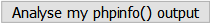

# Ubuntu installing Xdebug for PHP7


以前在學校學 Java 的時候，老師讓我們使用 Eclipse 這款 IDE 來開發，並一再強調使用 IDE 的 debug 功能和看 error message 有多重要，除此之外，一直以來寫我寫 code 都是用 Sublime / Atom 這種輕量級的 editor 來開發，並沒有深入的去研究 IDE。

最近發現 PhpStorm 這款 IDE 的公司 JetBrains 有提供免費的[學生方案](https://www.jetbrains.com/student/)(而且是所有產品)，我就想說可以趁這個機會來試試看看 IDE，便馬上申請並下載了 PhpStorm。

才想說終於可以開始學習使用 IDE 了，結果要安裝 xdebug 就一直撞牆...
不管我怎麼改就是會出現這個錯誤訊息。

```
Xdebug requires Zend Engine API version 320160303.
The Zend Engine API version 320151012 which is installed, is newer.
```

浪費了一堆時間，最後發現只是因為我的電腦裡有多個不同版本的 PHP...
因此整理一篇筆記，看能不能幫到[需要幫忙的人]^(未來的我)。

## 開始安裝

>測試環境
>
>OS：Ubuntu 16.04 LTS
>
>PHP開發環境：XAMPP 7.1.1

### 1. 匯出你的 php info 到家目錄
```bash
php -i > ~/php-info.txt
```

如果沒辦法匯出就加上 `sudo` 試試看

### 2. 使用 Xdebug Wizard
打開剛才產生的 php-info.txt，將內容複製到 [Xdebug Wizard](https://xdebug.org/wizard.php) 並點選 Analyse my phpinfo() output 按鈕


Xdebug Wizard 這個工具可以解析你的PHP版本、Zend API 版本諸如此類安裝所需要的資訊。

點按鈕後你會得到這樣的說明

> 1. Download [xdebug-2.5.3.tgz](http://xdebug.org/files/xdebug-2.5.3.tgz)
> 2. Unpack the downloaded file with `tar -xvzf xdebug-2.5.3.tgz`
> 3. Run: `cd xdebug-2.5.3`
> 4. Run: `phpize` (See the FAQ if you don't have phpize.
>
>    As part of its output it should show:
 ```bash
 Configuring for:
 ...
 Zend Module Api No:      20160303
 Zend Extension Api No:   320160303
 ```
>
> If it does not, you are using the wrong phpize. Please follow this [FAQ entry](http://xdebug.org/docs/faq#custom-phpize) and skip the next step.
>
> 1. Run: `./configure`
> 2. Run: `make`
> 3. Run: `cp modules/xdebug.so /opt/lampp/lib/php/extensions/no-debug-non-zts-20160303`
> 4. Edit `/opt/lampp/etc/php.ini` and add the line
```bash
zend_extension = /opt/lampp/lib/php/extensions/no-debug-non-zts-20160303/xdebug.so
```

### 3. 不要完全照著 Xdebug Wizard 的說明做

先照著 Xdebug Wizard 說明 1~3 步，然後停一下

1. 下載 Xdebug
2. 解壓縮
3. 進入解壓縮後的資料夾內
```bash
cd xdebug-2.5.3
```

再來這步就很重要了，我會一直裝不起來就是死在這

首先要確認你執行 phpize 是不是在你要佈署的環境

4. 執行 phpize

    ```bash
    which phpize
    ```

>回傳結果
>```bash
>/usr/bin/phpize
>```

這意味著我輸入 `phpize` 的時候是執行 `/usr/bin/phpize` 的phpize

但是我要佈署的是 xampp 的 php 才對呀！

那 xampp 的 phpize 在哪呢？

如果你不知道 xampp 的 phpize 在哪裡可以問問 [神奇海螺]^(whereis)

```bash
whereis phpize
```

>回傳結果
>```bash
>phpize:
>/usr/bin/phpize
>/usr/bin/phpize7.0
>/opt/lampp/bin/phpize
>```

回傳的結果顯示我的系統內有 3 個 phpize，我要使用的是最下面的 xampp 的 phpize

接著就可以開始說明的第 4 步了，只不過要把 `phpize` 換成 `/opt/lampp/bin/phpize`


以你的路徑為主，我的路徑可能和你的不一樣


```bash
/opt/lampp/bin/phpize
```

>回傳結果
>```
>Configuring for:
>PHP Api Version:         20160303
>Zend Module Api No:      20160303
>Zend Extension Api No:   320160303
>```

5. configure 它並帶上 php-config 路徑

如果你不知道 php-config 路徑一樣問 [神奇海螺]^(whereis)

```bash
whereis php-config
```

>回傳結果
>```bash
>php-config:
>/usr/bin/php-config
>/usr/bin/php-config7.0
>/opt/lampp/bin/php-config
>```

一樣我要使用的是 xampp 的 php-config

```bash
sudo ./configure --enable-xdebug --with-php-config=/opt/lampp/bin/php-config
```

結果太長就不附上了

6. 產生文件

```bash
make
```

7. 將產生好的文件複製到你要放 xdebug.so 的目錄

```bash
cp modules/xdebug.so /opt/lampp/lib/php/extensions/no-debug-non-zts-20160303
```

8. 修改 php.ini 在結尾加入這幾行就安裝完成了，現在你可以透過編輯器來 debug 啦！

```
[xdebug]
zend_extension=/opt/lampp/lib/php/extensions/no-debug-non-zts-20160303/xdebug.so
xdebug.remote_autostart=1
xdebug.remote_enable=1
xdebug.remote_host=localhost
xdebug.remote_port=9000
xdebug.remote_handler=dbgp
```

...如果你不知道php.ini在哪裡...知道該問誰了吧？

9. 驗收

再來只要把 Apache Server 重開就可以打完收工啦。

```bash
sudo service apache2 restart
php -v
```

>回傳結果
>```
>PHP 7.1.1 (cli) (built: Feb  1 2017 01:39:46) ( NTS )
>Copyright (c) 1997-2017 The PHP Group
>Zend Engine v3.1.0, Copyright (c) 1998-2017 Zend Technologies
>    with Xdebug v2.5.3, Copyright (c) 2002-2017, by Derick Rethans
>```

有看到最後那行 `with Xdebug v2.5.3, Copyright (c) 2002-2017, by Derick Rethans` 就代表順利完成了。

---

## references :

* [現在PHP版本那麼多，編譯出屬於自己的xdebug才是王道](http://blog.crazyphper.com/?p=3477)

